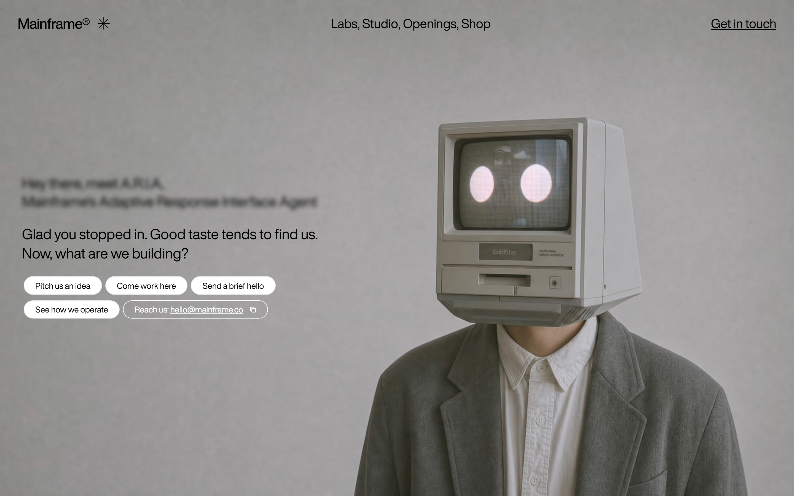
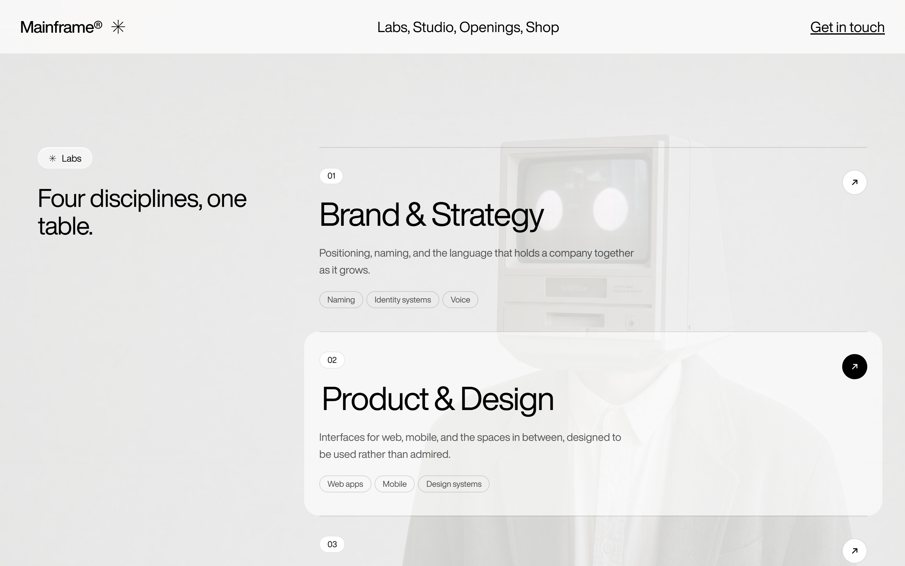
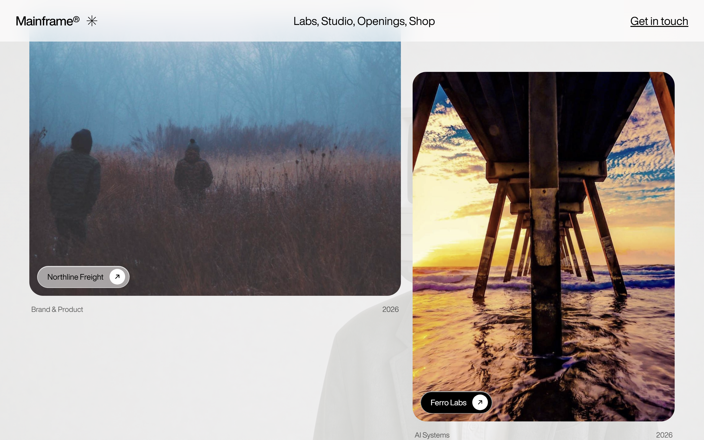
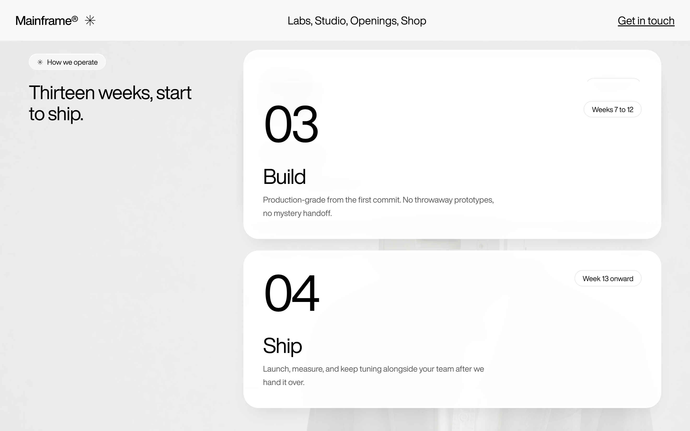
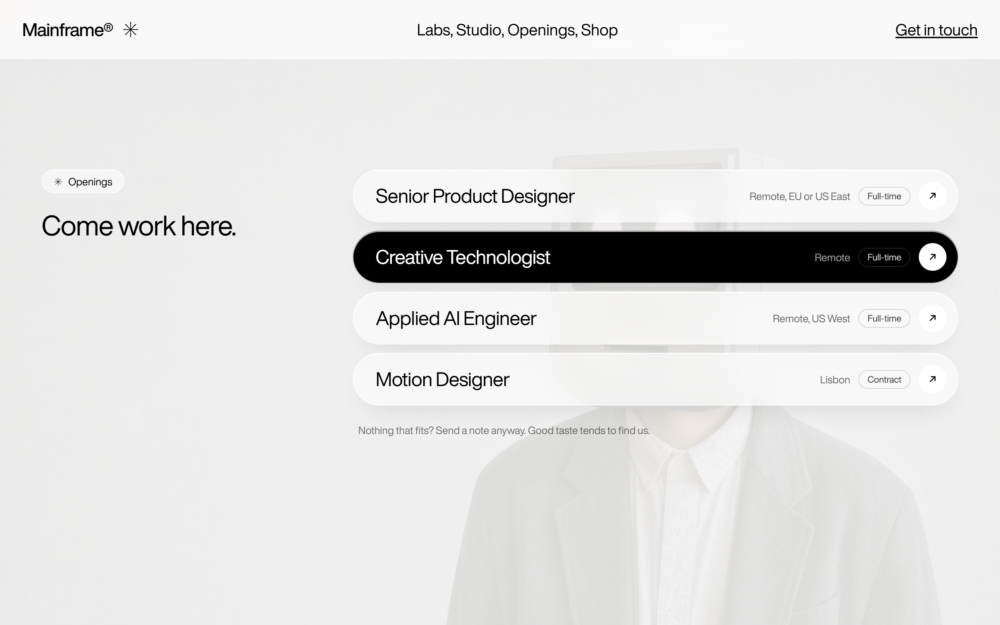

# Mainframe — Creative Agency Landing Page

A full landing page for a fictional creative agency, built with React, TypeScript, Vite, and Tailwind CSS v4. The hero scrubs a full-screen background video with horizontal mouse movement, and every section below it floats over that video in the same glass-and-pill design language.



## Features

- **Mouse-scrubbed video hero** with a typewriter intro, blurred label, and pill actions
- **Sections:** capability marquee, About, Labs (services), Studio (selected work), How we operate (sticky stack), Openings, Contact, Footer
- **Scroll reveals** with blur-in, respecting `prefers-reduced-motion`
- **Responsive** with a mobile menu overlay
- No UI libraries: only React, Tailwind, and Vite

## Getting started

```bash
npm install
npm run dev
```

Build for production with `npm run build`.

## Screenshots

| | |
|---|---|
|  |  |
|  |  |

Mobile: [hero](docs/mainframe-10-mobile-hero.png), [menu](docs/mainframe-11-mobile-menu.png), [labs](docs/mainframe-12-mobile-labs.png)

## Notes

- Studio project images are Picsum placeholders; replace the seeds in `src/components/Work.tsx` with real work.
- Fonts load from onlinewebfonts.com (Helvetica Now Display).
